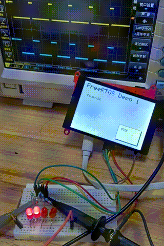
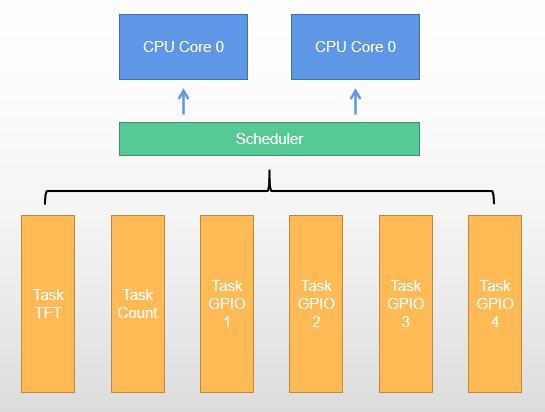
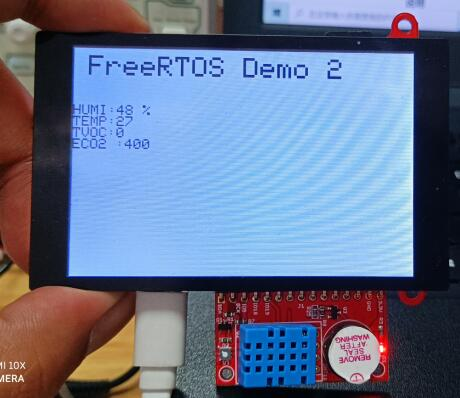
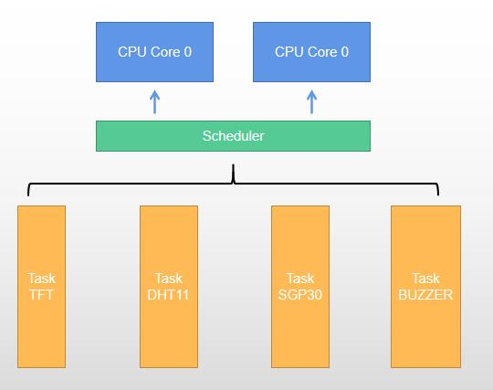
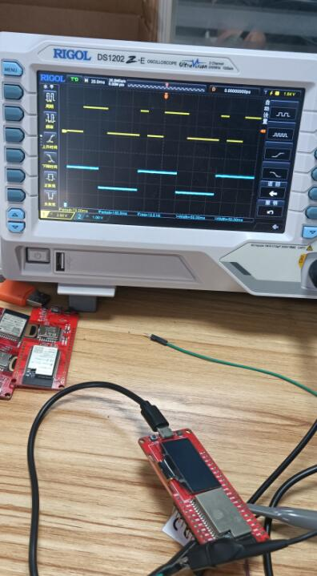
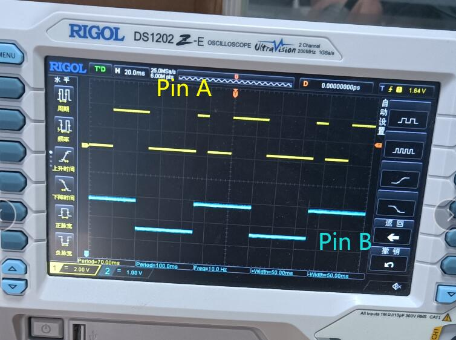
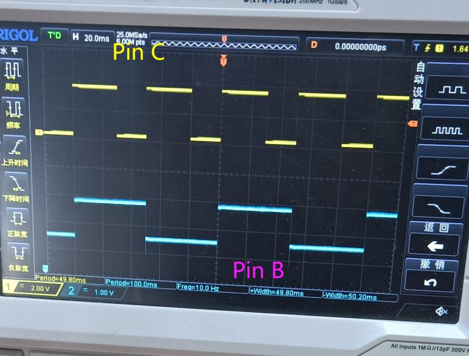
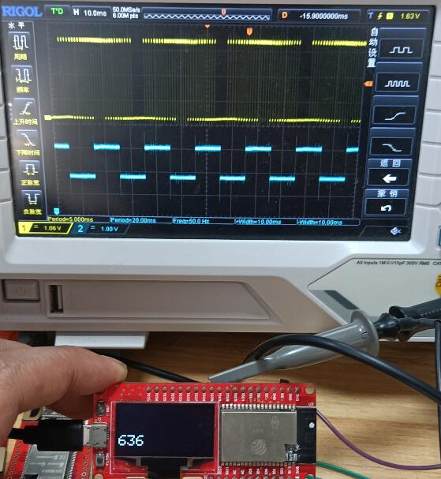
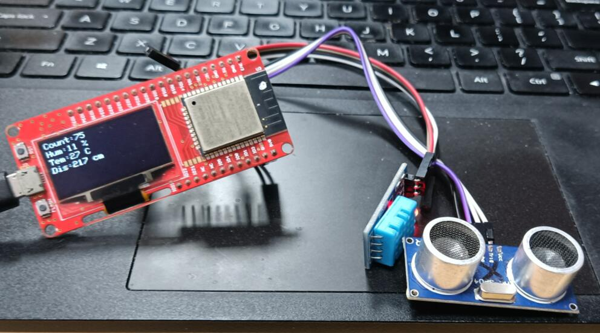

# RTOS Test

[toc]

# RTOS

To ease the development of complex programs, I tried some simple RTOS.


## What is RTOS

A real-time operating system (RTOS) is an operating system (OS) for real-time applications that processes data and events that have critically defined time constraints. An RTOS is distinct from a time sharing operating system, such as Unix, which manages the sharing of system resources with a scheduler, data buffers, or fixed task prioritization in a multitasking or multiprogramming environment. Processing time requirements need to be fully understood and bound rather than just kept as a minimum. All processing must occur within the defined constraints. Real-time operating systems are event-driven and preemptive, meaning the OS is capable of monitoring the relevant priority of completing tasks, and make changes to the task priority. Event-driven systems switch between tasks based on their priorities, while time-sharing systems switch the task based on clock interrupts.

[ESP32 RTOS Guide](https://docs.espressif.com/projects/esp-idf/en/latest/esp32/api-reference/system/freertos.html)

[FreeRTOS](https://www.freertos.org/)


## Feature

- Hard real-time response to **RTOS** based on priority preemption, according to the real-time needs of the task, perform priority scheduling
- Maximize system performance
- Reduce complexity
- Manage peak load
- Tightly integrated middleware
- Bigger development team
- Easy to debug and verify
- Code reuse


## How to use

FreeRTOS is included with the Arduino IDE and requires only the ESP32 board to be installed.

First create a task in setup().

```c++
void setup()
{
    xTaskCreatePinnedToCore(Task_TFT, "Task_TFT", 4096, NULL, 3, NULL, ARDUINO_RUNNING_CORE);
}
```

Second declare task function.

```c++
void Task_TFT(void *pvParameters) // This is a task.
{
    (void)pvParameters;

    tft_init();
    touch_init();

    while (1) // A Task shall never return or exit.
    {
        test_page();
    }
}
```

Over.


# Example

## Touch Screen Camera

[Wiki](https://www.makerfabs.com/wiki/index.php?title=ESP32_TFT_LCD_with_Camera(3.5%27%27))

[Github: Project_Touch-Screen-Camera](https://github.com/Makerfabs/Project_Touch-Screen-Camera)

### Demo1

Count is controlled by touch screen. In addition, two PWM waves and two square waves are output on four GPIO.




Create six tasks.

```c++
    xTaskCreatePinnedToCore(Task_TFT, "Task_TFT", 4096, NULL, 3, NULL, ARDUINO_RUNNING_CORE);
    xTaskCreatePinnedToCore(Task_Count, "Task_Count", 2048, NULL, 1, NULL, ARDUINO_RUNNING_CORE);
    xTaskCreatePinnedToCore(Task_GPIO_1, "Task_GPIO_1", 2048, NULL, 2, NULL, ARDUINO_RUNNING_CORE);
    xTaskCreatePinnedToCore(Task_GPIO_2, "Task_GPIO_2", 2048, NULL, 2, NULL, ARDUINO_RUNNING_CORE);
    xTaskCreatePinnedToCore(Task_GPIO_3, "Task_GPIO_3", 2048, NULL, 2, NULL, ARDUINO_RUNNING_CORE);
    xTaskCreatePinnedToCore(Task_GPIO_4, "Task_GPIO_4", 2048, NULL, 2, NULL, ARDUINO_RUNNING_CORE);   
```





### Demo2

Display the sensor's value on the screen, and periodically make the buzzer sound.




Create 4 tasks.

```c++

	xTaskCreatePinnedToCore(Task_TFT, "Task_TFT", 4096, NULL, 3, NULL, ARDUINO_RUNNING_CORE);
    xTaskCreatePinnedToCore(Task_DHT11, "Task_DHT11", 2048, NULL, 2, NULL, ARDUINO_RUNNING_CORE);
    xTaskCreatePinnedToCore(Task_SGP30, "Task_SGP30", 2048, NULL, 1, NULL, ARDUINO_RUNNING_CORE);
    xTaskCreatePinnedToCore(Task_BUZZ, "Task_BUZZ", 2048, NULL, 1, NULL, ARDUINO_RUNNING_CORE);
```





## MakePython ESP32

[MakePython ESP32](https://www.makerfabs.com/wiki/index.php?title=MakePython_ESP32)

### test1

Multiple GPIO outputs simultaneously.

Pin A high level 10ms, low level 20ms, high level 30ms, low level 40ms, cycle.

Pin B high level 50ms, low level 50ms, cycle.

Pin C high level 30ms, low level 20ms, cycle.








####  RTOS

Using RTOS, only need to be divided into three tasks, independent adjustment of time.

```c++
//Pin A 
void Task1()
{
    //Pin set
    pinMode(PIN_A, OUTPUT);
    while (1) // A Task shall never return or exit.
    {
        digitalWrite(PIN_A, HIGH);
        vTaskDelay(10);
        digitalWrite(PIN_A, LOW);
        vTaskDelay(20);
        digitalWrite(PIN_A, HIGH);
        vTaskDelay(30);
        digitalWrite(PIN_A, LOW);
        vTaskDelay(40);
    }
}
void Task2()
{
    //Pin B control
    //...
}
void Task3()
{
    //Pin C control
    //...
}
```

#### No RTOS

Through the software timer, manually determine whether the time of pin change has been reached:

```c++
//Set pin A
#define PIN_A_DELAY 10 //ms
long time_A = millis();
int pin_A_value = LOW;
//Set pin B
//...
//Set pin C
//...

void loop
{
    //...
    
    if(millis() - runtime_A) >= PIN_A_DELAY)
	{
	    digitalWrite(PIN_A, pin_A_value);
	    pin_A_value = !in_A_value;
	}
	if(millis() - runtime_B) >= PIN_B_DELAY)
	{
	    //...
	}
	if(millis() - runtime_C) >= PIN_C_DELAY)
	{
	    //...
	}
    
    //...
}


```


### test2

When driving the I2C protocol screen, SSD1306, GPIO outputs the changing duty cycle of the changing square wave and the fixed frequency of the square wave.




### test3

Multiple sensors of different protocols are periodically detected and output to the screen.
SSD1306, I2C protocol, screen driver.
AHT10, single wire protocol, measurement of air temperature and humidity.
HC-SR04, private protocol, calculates distance according to pulse time.

